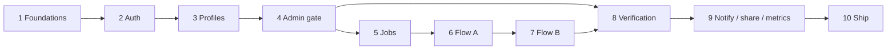

# Staffbro — implementation plan

Source: [Staffbro MVP PRD v1.2](./Staffbro_MVP_PRD.pdf) (18 Sep 2026). Stack: [TECH_STACK.md](./TECH_STACK.md). UI: [Stitch Ui](./Stitch%20Ui/).

Audience: Muhammad Haris (backend), Farhan Manzoor (mobile), Khizar Sheikh (domain / ops / UAT).

**Current build target: MVP** (prototype hiring loop plus profiles, catalog filters, business approval, admin, notifications, phone verification, analytics, and public job share). The 10-phase full-product plan below remains the roadmap for CNIC/NADRA, push, refresh-token rotation, and payments.

**MVP user loop**

```text
Open Staffbro
   ↓
Log in or create account (Job Seeker or Company Manager)
   ↓
Verify phone  ·  complete profile (profession, skills, area, salary, availability)
   ↓
Job seeker: filter/search jobs → apply → see Applied / In Review / Hired / Rejected
            accept or decline a direct offer → WhatsApp/Call after hire
Company: wait for admin approval → post/edit/close/reopen jobs
         review applicants (in review / hire / reject)
         discover available workers → send a direct offer
Admin web: approve businesses, suspend users, inspect jobs/applications, read analytics
```

**Pilot shape (full product, later):** Android APK for Islamabad / Rawalpindi. The 10-phase plan still maps to an ~11–12 week pilot after this prototype.

---

## MVP — from prototype

**Status: implemented in the repo.** Extends the 2-day prototype with the marketplace rules needed to run a real hiring loop in Islamabad / Rawalpindi.

**Still out of this MVP (stay on the 10-phase plan):** CNIC / NADRA ID, push notifications, refresh-token rotation, rate limits, payments, in-app chat, AI matching, photo pipeline.

### MVP map

| Slice | What shipped |
| --- | --- |
| Business gate | New companies start `PENDING`. Only `ACTIVE` companies post jobs. Admin approve/reject queue + approved badge. |
| Profiles | Worker: profession, skills, experience, area, expected salary, availability, employment type, bio. Business: type, location, description, status. |
| Catalog | Profession, skills, Islamabad/Rawalpindi areas used in profiles, job create, and filters — not API-only. |
| Jobs | Required profession, skills, employment type, Open/Closed/Filled, edit, close, reopen. |
| Applications | Applied / In Review / Hired / Rejected. Duplicate apply blocked. Direct offer must be accepted or declined. |
| Discovery | Worker job filters (profession, skills, area, salary, employment type) plus search. Business worker search/filters; phone hidden until hire. |
| Trust | Phone OTP verification + verified badge. Contact unlock after hire both ways. |
| Admin | Separate ADMIN login, dashboard metrics, user suspend, job close, application inspect, audit log. |
| Notifications | In-app events for apply, status change, hire, direct offer, approval. |
| Share / i18n | Public `/share/jobs/{id}` page. English/Urdu language switch plus bilingual labels. |

**Owners:** same team; ship vertical slices, not empty shells.

**Depends on:** Phase 1 foundations already in the repo (catalogues, Docker, Expo shell, generated client).


### Prototype map

| Phase | Name | When | Exit | Status |
| --- | --- | --- | --- | --- |
| P1 | Accounts and role | Day 1 morning | Register / login; Job Seeker vs Company Manager routes | **In repo** (live smoke needs Docker) |
| P2 | Jobs | Day 1 afternoon | Company posts a job; seekers see open jobs | **In repo** (live smoke needs Docker) |
| P3 | Apply and hire | Day 2 | Seeker applies; company hires from applicants or hires a seeker directly | **In repo** (live smoke needs Docker) |

Working rules from the full plan still apply: modular monolith, error envelope, keyset lists, no secrets in the app bundle, Stitch tokens on mobile.

---

### Prototype Phase 1 — Accounts and role

**Goal:** A person opens the app, creates an account or logs in, and continues as a **Job Seeker** (`WORKER`) or **Company Manager** (`BUSINESS`).

**Backend**

- Tables: `users` (phone unique E.164, password hash, role, full name, ToS timestamp). Worker register also creates `worker_profiles`. Business register also creates `businesses` already `ACTIVE` (no admin queue in the prototype).
- `POST /api/v1/auth/register`, `POST /api/v1/auth/login`, `GET /api/v1/auth/me`.
- Phone `03xx…` → `+923xx…`. Duplicate phone → `409 PHONE_TAKEN`. Bad login → generic `401`. Password ≥ 8, Argon2id. Passwords never logged.
- Prototype token: one access JWT (days, not 15 minutes) so testers are not kicked out. Refresh rotation, reuse detection, and admin-only registration stay in full-product Phase 2.

**Mobile (Stitch)**

- Welcome: 100% Free bar; select Job Seeker or Company Manager (English + Urdu as in Stitch).
- Register / login with phone + password. Role after login opens `(worker)` or `(business)` tabs. Guards send the other role away.
- Token in `expo-secure-store`. Fetch attaches `Authorization: Bearer`.

**Definition of done**

- [ ] Register as seeker and as company manager with different phones.
- [ ] Login returns the matching home (Jobs tab).
- [ ] Wrong password does not reveal whether the phone exists.

---

### Prototype Phase 2 — Jobs

**Goal:** A company manager posts a vacancy. A job seeker sees the open list and can open a card.

**Backend**

- Table: `jobs` (`business_id`, title, description, salary min/max integer PKR, location label, optional `profession_id`, `OPEN` / `CLOSED`).
- `POST /api/v1/jobs` (manager of that business). `GET /api/v1/jobs` open jobs for seekers. `GET /api/v1/jobs/mine` for the company. `GET /api/v1/jobs/{id}`.
- No `PENDING_APPROVAL` gate. Seed 1–2 demo jobs so the seeker feed is not empty on first launch.

**Mobile (Stitch jobs feed / post-job)**

- Seeker Jobs tab: list from API (title, business, salary, area, Apply later in P3). Trust bar stays (“100% Free”).
- Company Jobs tab: own postings + **Post New Job** (title, salary, location, description). Primary CTA full width, `#005f42`.

**Definition of done**

- [ ] Company posts a job; it appears on the seeker feed.
- [ ] Seeker cannot post a job (`403`).

---

### Prototype Phase 3 — Apply and hire

**Goal:** Close the hiring loop both ways.

**Flow A — seeker applies**

- Seeker taps Apply on an open job. One application per seeker per job (`409` if duplicate).
- Company sees applicants on Applications. Company can **Hire**.

**Flow B (lite) — company hires directly**

- Company sees a list of job seekers and hires one onto an open job (creates a `HIRED` candidacy with source `DIRECT_HIRE`). Phone of the other party is returned only after hire — not on the public seeker card.

**Backend**

- Table: `candidacies` (job, worker user, `APPLIED` / `HIRED` / `REJECTED`, source `APPLY` / `DIRECT_HIRE`, unique job+worker).
- Apply, list mine, list applicants, hire, list seekers, direct-hire.

**Mobile**

- Seeker Applications tab: status chips (Applied / Hired).
- Company Applications tab: applicants + Hire; seeker list + Hire directly.
- Profile tab: name, role, Log out.

**Definition of done**

- [ ] Seeker applies; company sees them and can hire.
- [ ] Company can hire a seeker who did not apply, onto an open job.
- [ ] Public seeker list does not include phone numbers.

---

### Prototype out of scope

Do not pull these into the two days: email login, OTP, CNIC, admin TOTP, push, WhatsApp API, payments, chat, AI matching, CV upload, share links, EAS production signing beyond what already exists.

After P3 is green, resume the **10-phase plan** from remaining Phase 2 hardening (refresh rotation, rate limits) and Phase 4 (admin gate) — do not pretend the prototype replaced the PRD.

---

## How to use this plan (full product)

1. Do not start a phase until the previous phase’s definition of done is green.
2. Contract-first: OpenAPI change → generated TypeScript client → both sides implement. CI fails if the committed client is stale.
3. `main` is protected. Every PR is reviewed by one other person. Branches are ≤ 2 days old.
4. If a phase slips, drop P1 in this order (PRD cut-line): nudges (`CAN-10`) → saved items → push → Urdu UI → share link (drop share last; it is the growth lever).
5. Do not pull P2 work (CV upload, email login, OTP, AI matching, in-app chat, payments) into these 10 phases.

### Working rules that apply in every phase

| Rule | Meaning |
| --- | --- |
| Modular monolith | Modules call each other’s **services**, never each other’s tables. |
| Layers | Router = HTTP + schemas. Service = rules + authz + transactions. Repository (only if queries are non-trivial) = SQL. |
| Authz | Ownership / membership checked in the service layer. Cross-tenant reads return `404`, not `403`. Admin routes require `role = ADMIN`. |
| Errors | `{ "error": { "code", "message", "details" } }`. Lists use keyset pagination (`limit` + `cursor`). |
| PII | Never log passwords, tokens, CNIC data, full phones (mask to last 3), or document paths. |
| Tests | Every phase adds unit tests for its rules **and** extends the authz matrix (every new endpoint × `WORKER` / `BUSINESS` / `ADMIN` / anonymous). |

### Open decisions that block phases

Resolve these in Phase 1 (PRD D0–D10). Do not invent product behaviour behind them.

| ID | Needed by | Blocks | Status |
| --- | --- | --- | --- |
| D1 Business types (`OTHER`?) | Phase 1 | Catalogue seed | **Done — restaurant / hotel / grocery only** |
| D2 Discovery privacy (initials vs full name) | Phase 3 | Worker card payload | Open |
| D3 Urdu RTL in pilot? | Phase 9 | i18n work in Phase 9 | Open |
| D5 Domain for share links / admin | Phase 5 | Job slugs, later `/j/:slug` | Open |
| D7 Profession / skill / area lists | Phase 1 | All search | **Done — starter seed in `backend/app/seed/catalog_data.py` (idempotent)** |
| D8 International payment card? | Phase 1 | Hosting fallbacks, Play Console later | **Done — Render Blueprint in `render.yaml` (free API + admin + 30-day Postgres)** |
| D4 CNIC HMAC? | Phase 8 | Identity duplicate detection | Open |
| D6 Who staffs admin + WhatsApp SLA | Phase 4 | Ops, not code | Open |
| D9 Workers/businesses ever pay? | Pilot | Out of these phases | Open |
| D10 Lawyer review of ToS/privacy | Phase 10 | Launch copy | Open |

---

## Full product phase map (after prototype)

| Phase | Name | Weeks | PRD origin | Exit | Status |
| --- | --- | --- | --- | --- | --- |
| 1 | Foundations | 1 | Release 0 | `/health` on staging; catalogues seeded; CI green | **In repo (local). Staging not deployed.** |
| 2 | Auth and accounts | 1 | Release 1 (auth half) | Register / login / refresh work on a real phone | Not started |
| 3 | Profiles | 1 | Release 1 (profile half) | Worker A cannot edit worker B; photo upload safe | Not started |
| 4 | Admin shell and business gate | 1 | Release 2 (admin half) | Founder approves a business in the web app | Not started |
| 5 | Jobs | 1 | Release 2 (jobs half) | Approved business posts a job a worker can find | Not started |
| 6 | Candidacies — Flow A | 2 | Release 3 | Apply → shortlist → contact → hire → confirm on 2 devices | Not started |
| 7 | Discovery and offers — Flow B | 1.5 | Release 4 | Business finds a worker, sends offer, phone revealed only then | Not started |
| 8 | Verification | 1.5 | Release 5 | Phone + ID verification with deletion proven | Not started |
| 9 | Notifications, share, metrics | 1 | Release 6 | Founders can run the pilot from admin + push | Not started |
| 10 | Harden, ship, dry-run | 1.5 | Release 7 | Signed APK; backup restore proven; Section 13.1 checklist green | Not started |



Phase 8 can start its phone-confirmation work in parallel with Phase 7 once Phase 4’s admin queues exist. ID verification must not go live until admin TOTP (Phase 4) is on.

---

## Phase 1 — Foundations

**Status: implemented in the repo (local Docker). Not fully DoD-green — see checkboxes.**

**Goal:** Empty repo becomes a deployable skeleton with a shared API contract and seed catalogues. No product features yet.

**Owners:** Haris (backend, CI, staging), Farhan (Expo + Vite shells, UI kit), Khizar (D1/D7 seed lists, 3+3 wireframe tests).

**Depends on:** PRD sign-off; decisions D1, D7, D8.

### Backend

- FastAPI app (`backend/app/main.py`) with `core/` (config, DB session, errors, logging) and empty module folders per PRD 12.3.
- SQLAlchemy 2.0 async + `asyncpg` against local Docker Postgres. Alembic wired; entrypoint runs `alembic upgrade head` under a Postgres advisory lock.
- Tables this phase: `locations`, `professions`, `skills` (with `name_en`, `name_ur`, `aliases[]`).
- Seed: Pakistan tree with full depth only for Islamabad and Rawalpindi; ~8 professions, 60–100 skills including Roman Urdu aliases (`bawarchi`, `rider`, …).
- `GET /health` (trivial DB query) and `GET /version`.
- OpenAPI skeleton: error envelope, Bearer auth scheme, pagination shape. Empty routers registered so the spec exists.
- Dockerfile. Staging deploy via repo-root `render.yaml` (Render Docker API + static admin + Postgres).

### Mobile / admin

- Expo Router project: `(auth)`, `(worker)`, `(business)` groups as empty screens; shared UI kit stubs (`Button`, `Field`, `Card`, `Badge`, `EmptyState`, `ErrorState`, `Skeleton`).
- Vite + React admin SPA stub, shadcn/ui, talks to the same API origin.
- i18n scaffolding (`react-i18next`); English resource file; **zero** hard-coded user-facing strings (`LOC-01`, `LOC-02`).
- Generated TypeScript client checked into `mobile/src/api/` (and admin) from OpenAPI.

### CI

- GitHub Actions: lint + typecheck (Python + TS), `alembic upgrade head` against ephemeral Postgres, fail if generated client is stale.
- `.env.example` documents every secret. Nothing secret in the repo or the app bundle.

### Testing

- Smoke: `/health` 200 against Docker Compose.
- Seed script is idempotent (re-run does not duplicate slugs).

### Definition of done

- [ ] PRD signed off; low-fi wireframes of ~15 core screens tested with 3 workers + 3 businesses. *(founder / Khizar — not code)*
- [x] Local Docker Compose file + API + Expo + admin shells in the repo (`docker compose up --build` on a machine with Docker Desktop running).
- [ ] Staging `/health` is up. *(code ready — create the Blueprint on Render after pushing this repo)*
- [x] Catalogue seed written and idempotent (`python -m app.seed`); 8 professions, 70+ skills, twin-city areas.
- [x] GitHub Actions workflow added (`.github/workflows/ci.yml`). Green on `main` after first push.

---

## Phase 2 — Auth and accounts

**Goal:** Phone-first identity that the rest of the product can trust. One `users` table, one role per account (`WORKER` / `BUSINESS` / `ADMIN`).

**Owners:** Haris (auth core, tokens, rate limits), Farhan (login / register / logout screens), Khizar (ToS wording input).

**Depends on:** Phase 1.

**Requirements:** `AUTH-01` … `AUTH-07`, `SAF-01`, `SAF-03`. (`AUTH-08` email is P2 — skip.)

### Backend

- Tables: `users`, `refresh_tokens`, `audit_logs`.
- Register: phone normalised to E.164 (`03xx…` → `+923xx…`), unique, password ≥ 8 chars, ToS version + timestamp stored. Duplicate → `409 PHONE_TAKEN`.
- Login: access JWT 15 min + rotating refresh 30 days stored hashed. Wrong credentials → generic `401`. 5 failures / 15 min per phone+IP → `429`. Suspended → `403 ACCOUNT_SUSPENDED`.
- Refresh with rotation and **reuse detection** (reuse of an old refresh token revokes the whole family). Logout revokes the refresh token.
- Change password (requires current; revokes other sessions). Admin-issued one-time reset code: hashed, 1 h, single use; all sessions revoked.
- `GET/PATCH/DELETE /me`. Account deletion can be a stub that 501s until Phase 10 if needed — prefer a real anonymise path now (`AUTH-07`).
- Argon2id. Passwords never logged. **Breached / common-password check at register** (architecture review: do not leave this as P1).
- `Idempotency-Key` middleware in place (used for real in Phases 6–7). In-process rate limiter (`slowapi`) is acceptable at one instance.
- Seed script creates `ADMIN` accounts — never via public registration.
- `POST /internal/tasks/:name` stub behind a secret header (cron lands in Phase 10).

### Mobile

- Register / login / logout. Role after login selects `(worker)` or `(business)` route group; guards redirect on mismatch.
- Access token in memory; refresh token in `expo-secure-store`. Fetch wrapper attaches Bearer, refreshes **once** on 401.
- ToS + privacy acceptance on signup (`SAF-03`: Staffbro never charges workers).

### Testing

- Unit: E.164 normalisation, hashing, refresh-family reuse.
- Integration: register → login → refresh → logout against real Postgres.
- Authz matrix v1: unauthenticated vs each role on `/me` and `/auth/*`.

### Definition of done

- [ ] Register / login / refresh work on a real Android phone.
- [ ] Suspended user cannot obtain a new access token.
- [ ] Reusing a rotated refresh token kills the family.
- [ ] No secrets in logs or the app bundle.

---

## Phase 3 — Profiles

**Goal:** A worker can complete a profile. A business user can create a business that sits in `PENDING_APPROVAL`. Catalogues drive professions, skills, and areas.

**Owners:** Haris (profile APIs, photo pipeline), Farhan (worker profile forms, business create), Khizar (validate seed lists against real job titles).

**Depends on:** Phase 2. Decision D2.

**Requirements:** `WRK-01` … `WRK-06`, `BIZ-01`, `BIZ-02`, `BIZ-03`, `BIZ-05` (read of pending state). `WRK-07` waits for Phase 7. `WRK-08` is P2. `WRK-09` waits for Phase 9. `BIZ-04` managers wait for Phase 9 if time.

### Backend

- Tables: `worker_profiles`, `worker_skills`, `worker_experience`, `worker_documents` (photo), `businesses`, `business_members`.
- Worker: profession, area, salary range (integer PKR), availability, commute scope, employment types, bio ≤ 300, ≤ 15 catalogue skills, experience with private reference fields that **never** appear in non-admin responses.
- Completeness meter recomputed server-side on each save (`WRK-05`).
- Discoverable ⇔ toggle on ∧ phone confirmed ∧ profession ∧ area ∧ availability ≠ `NOT_LOOKING`. Phone confirmation does not exist yet — discoverable stays false. That is correct.
- Business create: creator becomes `OWNER`; status `PENDING_APPROVAL`. Post/search/offer endpoints do not exist yet; when they do they return `403 BUSINESS_NOT_ACTIVE`.
- Photo: through the API only, 5 MB, magic-byte check, re-encode ≤ 512 px, strip EXIF/GPS, public `avatars` bucket, random UUID path (`WRK-04`, Section 13.3).
- `GET /catalog/professions|skills|locations` — cacheable.

### Mobile

- Worker onboarding + edit profile, skill picker, experience CRUD, photo picker (`expo-image-picker` + `expo-image-manipulator`).
- Business create + “awaiting approval” empty state (`BIZ-02`).
- Shared form stack: React Hook Form + Zod generated from / aligned with Pydantic.

### Testing

- Ownership: worker A cannot `PATCH` worker B.
- Unknown skill IDs rejected. Experience `end >= start`.
- Photo payload has no EXIF GPS. Completeness formula covered by unit tests.
- Authz matrix: business endpoints vs worker role, and vice versa.

### Definition of done

- [ ] Worker can save a complete-looking profile on a low-end Android.
- [ ] Worker A cannot edit worker B.
- [ ] Photo upload is re-encoded, EXIF-stripped, and served from a UUID path.
- [ ] Pending business exists in DB and shows the waiting state.

---

## Phase 4 — Admin shell and business gate

**Goal:** Founders can approve businesses and suspend users. **No public jobs until this gate works.** Admin accounts that will later see CNIC images get TOTP now, not in Phase 8.

**Owners:** Haris (admin APIs, audit, TOTP), Farhan or Khizar (admin SPA — Khizar if he is full-stack per A6), Khizar (UAT of the queue).

**Depends on:** Phase 3.

**Requirements:** `ADM-01`, `ADM-02`, `ADM-03` (queue UI; confirmations start in Phase 8), `ADM-05`, `ADM-09`, `SAF-01`.

### Backend

- Admin login uses the same auth with stricter rate limits.
- `GET /admin/businesses` + `POST /admin/businesses/:id/decision` (`ACTIVE` / `REJECTED` + reason).
- `GET /admin/users` + suspend / unsuspend + issue password-reset code.
- Every admin decision (and later every document view) written to `audit_logs` with no PII in `metadata`.
- **TOTP 2FA for `ADMIN`** (architecture review launch item; PRD listed it as “can wait” — do not wait if Phase 8 will show CNIC images).
- Pending business cannot post, search workers, or send offers — enforce in a shared `require_active_business` dependency so Phases 5–7 inherit it.

### Admin web

- Login, business approval queue (details, approve/reject), users list, suspend, password-reset code copy-out (founder sends it on WhatsApp).
- TanStack Table. Same generated client. CORS allow-list of the admin origin only.

### Testing

- Non-admin → `404` on `/admin/*`.
- Rejected / pending business is blocked on a stub “post job” service call.
- Audit row exists for each decision.
- TOTP required on admin login.

### Definition of done

- [ ] A founder can approve a business in under 2 minutes.
- [ ] `BUSINESS_NOT_ACTIVE` is the only way a pending owner hits write endpoints.
- [ ] Admin 2FA is on before any identity-document queue is built.

---

## Phase 5 — Jobs

**Goal:** An `ACTIVE` business posts a job. A worker searches and opens it, including Call / WhatsApp on the business number (job-level contact, no candidacy yet).

**Owners:** Haris (jobs module, search SQL), Farhan (job list/filter/detail, post/edit/close), Khizar (sample job copy, Roman Urdu search terms).

**Depends on:** Phase 4. Decision D5 (slug domain can be a placeholder).

**Requirements:** `JOB-01` … `JOB-03`, `JOB-05`, `JOB-06`, `JOB-08`, `CON-01` … `CON-03` (job-level), `LOC-04`. `JOB-04` expiry is P1 (Phase 9/10). `JOB-07` share link is Phase 9.

### Backend

- Tables: `jobs`, `job_skills`, `contact_events` (job-level rows; `candidacy_id` nullable).
- Post job with server-side validation (salary min ≤ max, catalogue FKs). Only members of an `ACTIVE` business. Close with reason (`FILLED`, `NO_LONGER_NEEDED`, `ADMIN_REMOVED`).
- Search: profession, skills, area/city, min salary, employment type, meals/accommodation, text. Default sort newest. Keyset pagination, 20/page. Text matches title + profession/skill **aliases** (Roman Urdu).
- `pg_trgm` GIN on titles and alias arrays. `EXPLAIN` the common filter combinations against ≥ 1k seeded rows (10k if time).
- Job detail includes business info + Call / WhatsApp. Taps `POST /jobs/:id/contact-events`.
- Business sees own jobs with applicant counts (count is 0 until Phase 6).
- Cross-business edit → `403`. Cross-business read of private lists → `404`.

### Mobile

- Worker: job list, filters, detail, contact buttons (`tel:` / `wa.me` with prefilled job title + Staffbro).
- Business: post / edit / close, own-jobs list.
- List virtualisation. Image payloads stay ≤ ~150 KB. Loading / empty / error states use shared components.

### Testing

- Business A cannot edit business B’s job.
- Pending business cannot post.
- Search for a Roman Urdu alias returns the English-titled job.
- Phone numbers in job/business payloads are E.164; worker phones are **absent**.

### Definition of done

- [ ] Approved business posts a job.
- [ ] Worker finds it via a Roman Urdu keyword.
- [ ] Contact tap writes a `contact_event`.
- [ ] Low-end Android list scroll is usable.

---

## Phase 6 — Candidacies (Flow A — worker applies)

**Goal:** One pipeline, one state machine. A worker applies; the business moves the candidacy; phones reveal only inside that candidacy; the worker can confirm a hire.

**Owners:** Haris (state machine, events, reveal rules), Farhan (apply, “My applications” timeline, business applicant list), Khizar (UAT scripts for the happy path).

**Depends on:** Phase 5.

**Requirements:** `CAN-01`, `CAN-04` … `CAN-08`, `CON-01` … `CON-03` (candidacy-level). `CAN-09`/`CAN-10`/`CAN-11` are P1 → Phase 9 if on schedule.

This is the load-bearing phase. Do not start Phase 7 until the machine is tested exhaustive.

### Backend

- Tables: `candidacies`, `candidacy_status_events`.
- `UNIQUE(job_id, worker_id)`. Duplicate apply → `409 ALREADY_CANDIDATE`.
- Apply only to `OPEN` + `PUBLIC` jobs. Creates `APPLIED` + immutable status event.
- Single `POST /candidacies/:id/transition` validates the PRD 7.2 table. Invalid → `422 INVALID_TRANSITION` with the allowed set. `REJECTED` requires a reason code. Terminal statuses cannot be left.
- `GET /candidacies/:id` returns worker phone **only** to participants of that candidacy. List/search/profile endpoints still must not.
- `Idempotency-Key` **required** (P0 here, not P1) on apply, transition, and confirm-hire.
- Hire confirmation: `POST /candidacies/:id/confirm-hire` sets `worker_confirmed_hire_at`.
- Worker list of own candidacies (both origins, even though origin B does not exist yet). Business list per job, filter status/origin; other business → `404`.

### Mobile

- Apply with optional note. Worker timeline of statuses. Business applicant list + transition actions + reason codes.
- Contact buttons on the candidacy screen; every tap logs `contact_event`.
- Confirm-hire prompt after `HIRED`.

### Testing

- Exhaustive state-machine unit tests (every from/to × actor).
- Duplicate apply. Worker cannot shortlist. Business cannot accept an offer (offers do not exist yet, but the table still encodes it).
- Automated assertion: list/search payloads never contain `phone`. Detail of a foreign candidacy → `404`.
- Idempotent apply: same key does not create a second row.

### Definition of done

- [ ] Full path on 2 devices: apply → shortlist → contact → hire → worker confirm.
- [ ] Phone is invisible until the candidacy exists, then visible only to its participants.
- [ ] Invalid transitions are 422 with the allowed set.

---

## Phase 7 — Discovery and offers (Flow B)

**Goal:** An `ACTIVE` business searches workers with deterministic ranking, views a privacy-stripped profile, and sends an offer against an `OPEN` job (creating an `UNLISTED` job inline if needed).

**Owners:** Haris (search ranking, rate limits, offers), Farhan (worker search UI, offer composer, offer response), Khizar (ranking sanity-check on real-ish seed data).

**Depends on:** Phase 6. Phone confirmation (Phase 8) will unlock real discoverability; until then, seed a few `phone_confirmed_at` workers in staging for UI work, or start Phase 8’s `VER-01` in parallel.

**Requirements:** `DSC-01` … `DSC-05`, `CAN-02`, `CAN-03`, `WRK-07`. `DSC-06` event logging is P1 — do it in this phase if cheap (write-only, no UI).

### Backend

- `GET /workers` only for `ACTIVE` businesses, only discoverable workers. Filters: profession, skills (any/all), area/city respecting `commute_scope`, experience range, expected salary max, availability, badges.
- Ranking, documented in code: verified badges → completeness → recent activity. Same query = same order.
- `GET /workers/:id` follows Section 7.7: no phone, no reference contacts, no coordinates. First name + last initial until a candidacy exists (D2).
- Rate limits: ≤ 15 new offers / business / day; ≤ 200 profile views / business / day → `429 VIEW_LIMIT`. Declined offer cannot be re-sent for the same job.
- `POST /jobs/:id/offers` (offer belongs to a job, never to a bare worker). Worker must be discoverable and accepting offers. No matching public job → create `visibility = UNLISTED` inline.
- Worker accept/decline only from `OFFERED`; decline takes a reason code. Accepting reveals phone inside `GET /candidacies/:id`.
- `Idempotency-Key` on offer create and accept/decline.

### Mobile

- Business: worker search + filters, worker card, profile, offer composer (pick or create job).
- Worker: incoming offers, accept/decline. `WRK-07` “accept direct offers” toggle.

### Testing

- Rate-limit tests. Phone never in list/profile payload (automated assertion).
- Ranking stability fixture.
- Unlisted job is hidden from `GET /jobs` but reachable via the offer.
- Inactive business → `403 BUSINESS_NOT_ACTIVE` on search.

### Definition of done

- [ ] Business finds a worker, sends an offer, worker accepts.
- [ ] Phone is revealed only after the offer candidacy exists.
- [ ] View/offer limits trip at the documented caps.

---

## Phase 8 — Verification

**Goal:** Manual trust. Phone confirmation via WhatsApp reverse OTP, ID review with short-lived images, optional experience call-outs, badges on cards.

**Owners:** Haris (documents, signed URLs, HMAC, purge task), Farhan (verification screens, badges), Khizar (WhatsApp number, queue SLA, first real reviews).

**Depends on:** Phase 4 (admin + TOTP). Should complete before relying on discovery in the pilot. Decision D4.

**Requirements:** `VER-01` … `VER-05`. `VER-04` experience is P1. `VER-06`/`VER-07` if time. `ADM-04`.

### Backend

- Tables: `verification_requests`, `worker_identity_hashes` (if D4 = yes), `worker_documents` for ID/selfie.
- Phone: `POST /verification/phone` returns a one-time code + `wa.me` link to Staffbro’s number (24 h). Admin queue confirms/rejects (`ADM-03` now live). Discoverability can turn on (`WRK-06`).
- ID: multipart upload to `private-docs`. Optional CNIC number HMAC’d then discarded. Admin `GET .../document` returns a **60-second signed URL**, every view audit-logged. Decision `VERIFIED` / `REJECTED` with reason; image **hard-deleted** at decision.
- Failsafe: `purge-identity-docs` deletes anything older than 14 days. Wire the task handler now; cron in Phase 10.
- Experience verification (P1): private reference visible only to admin; badge per entry + count on profile.
- Badges on worker cards; **no CNIC data** ever in business responses.
- Server-generated UUID filenames. Per-user upload limits. Magic-byte / signature checks.

### Mobile / admin

- Worker: Verify via WhatsApp, ID upload + consent copy (what the image is used for and that it is deleted).
- Admin: phone queue, ID queue with image viewer that cannot be screenshot-exfiltrated easily (short URL is the control), decision form.

### Testing

- Signed URL expires. Image gone after decision (storage 404). Failsafe purge on a backdated row.
- Upload abuse: wrong magic bytes, oversize, unexpected MIME.
- Phone change clears the phone badge (`VER-07` if in scope).
- Authz: worker cannot read another worker’s document; business cannot hit admin document URL.

### Definition of done

- [ ] End-to-end ID verification with deletion proven on staging.
- [ ] Phone-confirmed worker becomes discoverable; unconfirmed does not.
- [ ] Badges visible on cards. CNIC never is.

---

## Phase 9 — Notifications, share, metrics

**Goal:** The pilot is operable without founder Slack. Workers and businesses hear about state changes. Jobs can be dropped into WhatsApp groups. Founders see funnel numbers.

**Owners:** Haris (notifications table, metrics views, share page), Farhan (inbox, push wiring, saved items if time), Khizar (share-link copy, metric definitions check).

**Depends on:** Phases 6–8.

**Requirements (P1 — ship if on schedule):** `NTF-01` … `NTF-03`, `JOB-07`, `ADM-06`, `ADM-07`, `ADM-08`, `SAF-02`, `DSC-04`, `WRK-09`, `CAN-09` … `CAN-11`, `JOB-04`, `BIZ-04`, `LOC-03` (only if D3 = yes).

### Backend

- `notifications` + `push_tokens`. Writes on: new application, new offer, status change, hire-confirmation request, verification decision. Push is best-effort; failure never fails the API call (Expo Push).
- Public `GET /public/jobs/:slug` + web page `/j/:slug` with Open Graph tags and “Open in app / Download APK”. No worker data on that page.
- SQL views for Section 14 metrics. `GET /admin/metrics`, `GET /admin/audit-logs`.
- Reports: `POST /reports` + admin resolve (`SAF-02`, `ADM-07`).
- Admin jobs list + remove (`ADM-06`).
- P1 if time: saved jobs/workers, 30-day job expiry + renew, 14-day idle candidacy expiry, 48 h nudges, bulk-reject on fill, add/remove managers.

### Mobile / admin

- In-app inbox with deep links. Device token registration.
- Share job → WhatsApp.
- Admin: jobs, reports, metrics dashboard.

### Testing

- Push failure does not roll back a transition.
- Share page contains no worker PII.
- Metrics queries match the Section 14 definitions on a fixture dataset (confirmed vs unconfirmed hires reported separately).

### Definition of done

- [ ] Founders can run day-to-day ops from the admin panel.
- [ ] A job link previews in WhatsApp.
- [ ] At least application/offer/status-change notifications arrive on a test device.

---

## Phase 10 — Harden, ship, dry-run

**Goal:** A signed APK, a restore drill, and a Section 13.1 checklist that is actually green. Then a dry-run with 5 businesses / 30 workers.

**Owners:** Haris (backups, monitoring, rate-limit tuning, APK pipeline), Farhan (low-end device QA, crash reporting, EAS), Khizar (UAT, ToS/privacy final, assisted onboarding plan). Decision D10 lawyer session before public copy.

**Depends on:** Phase 9 (or Phase 8 if Phase 9 was cut to the bone).

### Ops and security

- Nightly encrypted `pg_dump` (`age`) in GitHub Actions, stored privately. **Restore drill once** (target RPO 24 h, RTO 4 h). Backups contain PII — encryption is mandatory. Confirm CNIC images are not in backups where avoidable (deleted-at-decision + failsafe).
- GitHub Actions cron → `POST /internal/tasks/:name`: `expire-candidacies`, `expire-jobs`, `purge-identity-docs` (hourly), `purge-notifications` (weekly). Tasks are idempotent.
- Keep-alive pinger on `/health` (~10 min) so Render free does not sleep in production. Staging may sleep.
- Sentry on API + app. Uptime check.
- Rate limits tuned on staging. HSTS on admin. Structured JSON logs with request ID.
- Account deletion completed (`AUTH-07`, Section 13.4): PII gone, documents deleted, counterpart history shows “Deleted user”.
- ToS + privacy copy final (lawyer). Play-store-policy deletion path in-app.

### Mobile distribution

- EAS Build (or local) **signed release APK** for WhatsApp/link sideload. Expo Go is not a distribution channel.
- JS-only hotfixes via EAS Update once the APK is out.
- Android 8+ on a 4-inch low-end phone: cold start < 4 s, font scaling, tap targets ≥ 48 dp, contrast ≥ 4.5:1 (`LOC` + NFR accessibility).

### Testing

- Pilot dry-run: 5 businesses, 30 workers, both flows, verification, a deliberate restore.
- Authz matrix complete for every shipped endpoint.
- State-machine tests still exhaustive after P1 additions.
- No critical bugs open.

### Definition of done

- [ ] All P0 requirements from this plan are done.
- [ ] Section 13.1 security checklist is green.
- [ ] Backup restore proven.
- [ ] Signed APK installed on devices that are not the developers’.
- [ ] Dry-run notes (what broke, what Khizar had to do by hand) filed as the first post-launch sprint backlog.

---

## Out of these 10 phases

Do not build now. The hook already exists in the schema or API:

| Excluded | Hook already in the MVP |
| --- | --- |
| In-app chat | `candidacy_id` is the future conversation key |
| AI matching | Structured skills, status events, search/view events |
| Payments / subscriptions | Add a business `plan` column later |
| Automated KYC / OCR | `verification_requests` abstracts “who decided” |
| SMS / email / WhatsApp API | `notifications` + one dispatcher |
| Ratings / interview scheduling | `HIRED` / `REJECTED` + `worker_confirmed_hire_at` |
| iOS / Play Store public listing | Same Expo codebase; Play after pilot |
| Microservices / Redis / Elasticsearch | One instance; Redis only when a second API box exists |

---

## Suggested GitHub labels

`phase:1` … `phase:10` · `p0` `p1` `p2` · `area:auth` `area:jobs` `area:candidacies` `area:verification` `area:admin` `area:mobile` `area:ops` · `blocked-by-decision`

Issue title pattern: `CAN-01 Worker applies to an OPEN PUBLIC job`.
